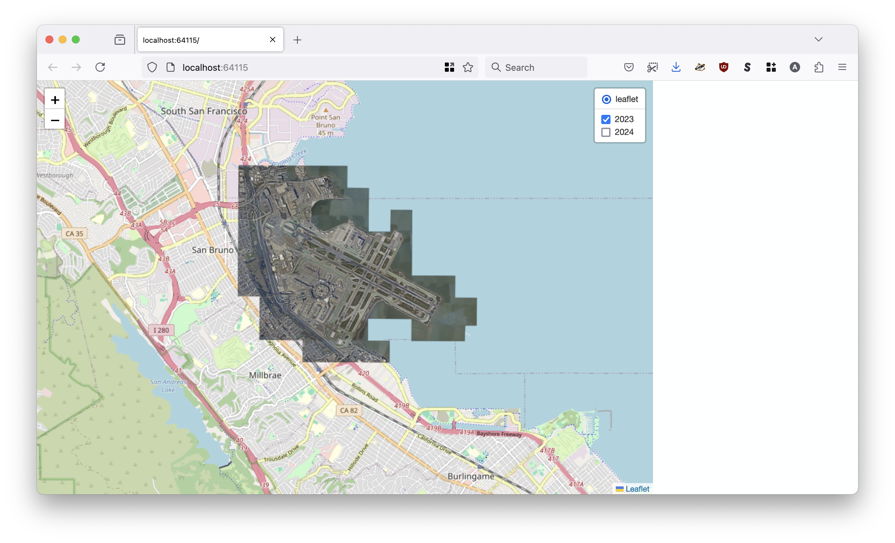
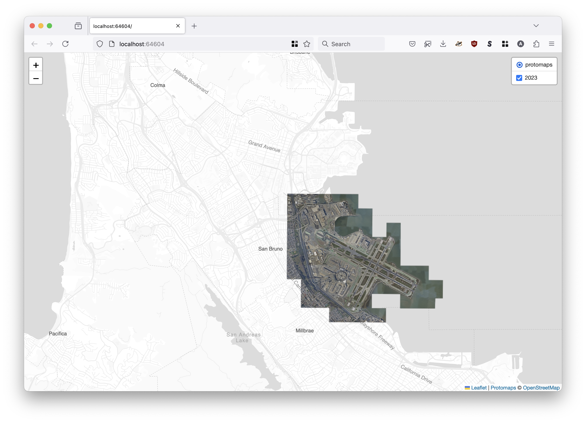
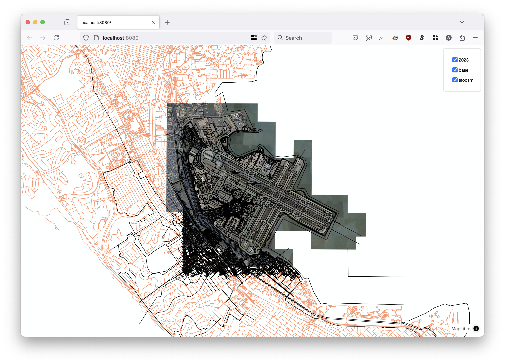
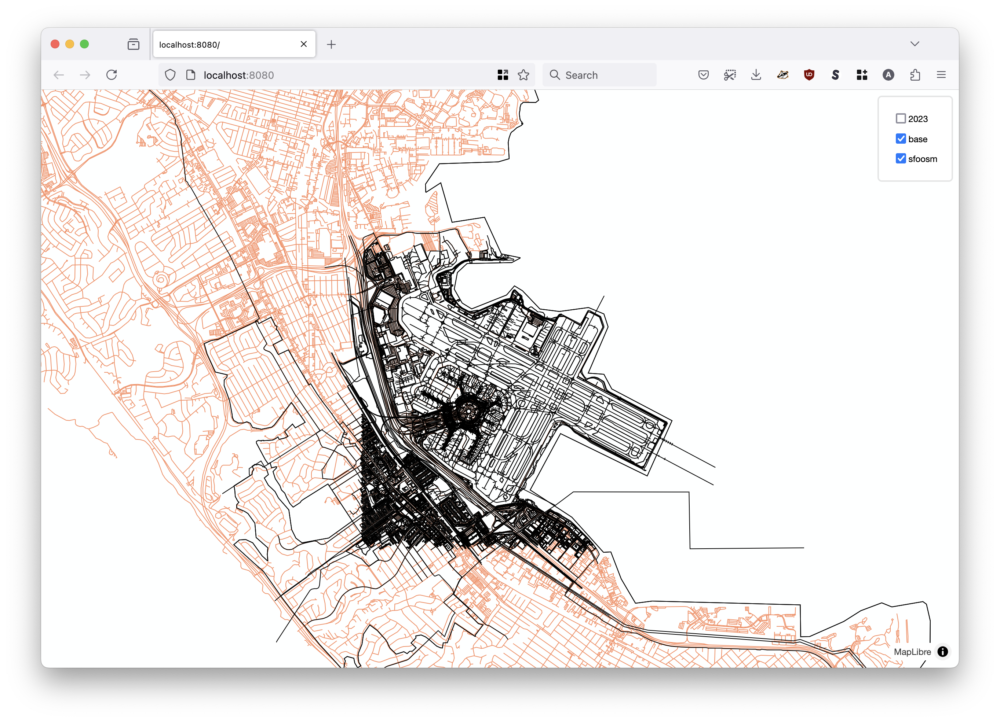

# go-mbtiles-show

Command-line tool for serving MBTiles databases from an on-demand web server.

## Motivation

It's basically a simpler and dumber version of [geojson.io](https://geojson.io/) but for [MBTiles databases](https://wiki.openstreetmap.org/wiki/MBTiles) that you can run locally from a single binary application.

Have a look at the [Small focused tools for visualizing geographic data](https://millsfield.sfomuseum.org/blog/2024/10/02/show/) blog post for more background.

## Documentation

Documentation (`godoc`) is incomplete at this time.

## Important

This is an early-stage project. It is incomplete and lacking features. Notably:

* The initial map zoom is the [San Francisco International Airport](https://spelunker.whosonfirst.org/id/102527513/). Code to query the extent of each MBTiles database being served needs to be written and then logic about which extent(s) should be the default view needs to be decided on.

* Minimum and maximum zoom levels for MBTiles database layers need to be derived in the Go code and passed down to the JavaScript/Leaflet code.

* Use of the [MapLibre-GL.js](https://maplibre.org/maplibre-gl-js/docs/) library is currently necessary to render MBTiles databases with vector data. I haven't figure out how to make it work with plain-vanilla Leaflet yet.

* There is only minimal styling for vector layers.

_I will get to these things eventually but patches are welcome._

## Tools

```
$> make cli
go build -mod vendor -ldflags="-s -w" -o bin/show cmd/show/main.go
```

To enable use the [WebViewBrowser `Browser` implementation](https://github.com/sfomuseum/go-www-show?tab=readme-ov-file#webviewbrowser-webview) tools will need to be build with the `webview` tag set. For example:

```
$> go build -mod vendor -ldflags="-s -w" -tags webview -o bin/show cmd/show/main.go
```

### show

```
$> ./bin/show -h
Command-line tool for serving MBTiles tiles from an on-demand web server.
Usage:
	 ./bin/show [options]
Valid options are:
  -base-tile-uri string
    	A valid raster tile layer or pmtiles:// URI. (default "https://tile.openstreetmap.org/{z}/{x}/{y}.png")
  -browser-uri string
    	A valid sfomuseum/go-www-show/v2.Browser URI. Valid options are: web:// (default "web://")	
  -map-provider string
    	The map provider to use for a base layer. Valid options are: leaflet, maplibre, protomaps (default "maplibre")
  -port int
    	The port number to listen for requests on (on localhost). If 0 then a random port number will be chosen.
  -protomaps-theme string
    	A valid Protomaps theme label. (default "white")
  -raster value
    	Zero or more {LAYER_NAME}={PATH} pairs referencing MBTiles databases containing raster data.
  -vector value
    	Zero or more {LAYER_NAME}={PATH} pairs referencing MBTiles databases containing vector (MVT) data.
  -verbose
    	Enable verbose (debug) logging.
```

## Base tile URIs

The default setting for base tiles is to use OpenStreetMap although you can also specify an alternate raster tile URL.

If the `-base-tile-uri` flag starts with `pmtiles://` then a local or remote PMTiles database will be used as the base map. `pmtiles://` URIs take the form of:

```
pmtiles:///PATH/TO/DATABASE.db
```

To use a PMTiles database on the local disk. Or:

```
pmtiles://api?key={PROTOMAPS_API_KEY}
```

To use PMTiles data return by the [Protomaps API](https://protomaps.com/dashboard).

## Examples

### Show multiple MBTiles databases containing raster data using Leaflet



```
$> ./bin/show \
	-map-provider leaflet \
	-raster 2023=/usr/local/sfomuseum/tiles/sqlite/2023.db \
	-raster 2024=/usr/local/sfomuseum/tiles/sqlite/2024.db \
	-verbose
	
2024/08/30 18:16:14 DEBUG Verbose logging enabled
2024/08/30 18:16:14 DEBUG Start server
2024/08/30 18:16:14 DEBUG HEAD request succeeded url=http://localhost:64211
2024/08/30 18:16:14 INFO Server is ready and features are viewable url=http://localhost:64115
2024/08/30 18:16:22 DEBUG Tile data is nil path=/tiles/2023/12/654/2511.png layer=2023
2024/08/30 18:16:22 DEBUG Tile data is nil path=/tiles/2023/12/655/2511.png layer=2023
2024/08/30 18:16:22 DEBUG Tile data is nil path=/tiles/2023/12/656/2511.png layer=2023
2024/08/30 18:16:22 DEBUG Serve tile path=/tiles/2023/12/655/2510.png layer=2023 "content type"=image/png length=49883
2024/08/30 18:16:22 DEBUG Tile data is nil path=/tiles/2023/12/654/2510.png layer=2023
2024/08/30 18:16:22 DEBUG Tile data is nil path=/tiles/2023/12/656/2510.png layer=2023
2024/08/30 18:16:22 DEBUG Tile data is nil path=/tiles/2023/12/655/2512.png layer=2023
... and so on
```

#### Caveats:

* Vector tiles are not supported if the `-map-provider` flag is "leaflet".

### Show an MBTiles database containing raster data using Leaflet and the Protomaps API  for the base map:



```
$> ./bin/show \
	-map-provider leaflet \
	-raster 2023=/usr/local/sfomuseum/tiles/sqlite/2023.db \
	-base-tile-uri 'pmtiles://api?key={PROTOMAPS_API_KEY}' \
	-verbose
	
go build -mod vendor -ldflags="-s -w" -o bin/show cmd/show/main.go
2024/09/03 18:26:13 DEBUG Verbose logging enabled
2024/09/03 18:26:13 WARN Leaflet map provider does not support rendering vector layers yet.
2024/09/03 18:26:13 DEBUG Start server
2024/09/03 18:26:13 DEBUG HEAD request succeeded url=http://localhost:64604
2024/09/03 18:26:13 INFO Server is ready and features are viewable url=http://localhost:64604
...and so on
```

#### Caveats:

* Vector tiles are not supported if the `-map-provider` flag is "leaflet".

### Show multiple MBTiles databases containing both raster and vector data using MapLibre:


```
$./bin/show \
	-raster 2023=/usr/local/sfomuseum/tiles/sqlite/2023.db \
	-vector sfoosm=/usr/local/data/sfo.osm.mbtiles \
	-verbose
	

2024/09/03 18:12:03 DEBUG Verbose logging enabled
2024/09/03 18:12:03 DEBUG Start server
2024/09/03 18:12:03 DEBUG HEAD request succeeded url=http://localhost:63979
2024/09/03 18:12:03 INFO Server is ready and features are viewable url=http://localhost:63979
... and so on
```

#### Caveats:

* There is currently only a single "line" based style for all vector layers.

### Show multiple MBTiles databases containing both raster and vector data using MapLibre and a local PMTiles database for the base map:

```
$> ./bin/show \
	-port 8080  \
	-raster 2023=/usr/local/sfomuseum/tiles/sqlite/2023.db \
	-vector sfoosm=/usr/local/data/sfo.osm.mbtiles \
	-base-tile-uri pmtiles:///usr/local/sfomuseum/go-http-protomaps/cmd/example/sfo.pmtiles \
	-verbose
	
2024/09/03 18:14:46 DEBUG Verbose logging enabled
2024/09/03 18:14:46 DEBUG Start server
2024/09/03 18:14:46 DEBUG HEAD request succeeded url=http://localhost:8080
2024/09/03 18:14:46 INFO Server is ready and features are viewable url=http://localhost:8080
... and so on
```





#### Caveats:

* There is currently only a single "line" based style for all vector layers.
* There is currently only a single "line" based style for base maps derived from a PMTiles database targeting the "roads" layer.
* Use of the `pmtiles://api?key={KEY}` URI for the `-base-tile-uri` flag does not trigger any errors but does not yield any map data. I don't know why yet.

## See also

* https://github.com/sfomuseum/go-mbtiles-server
* https://github.com/sfomuseum/go-geojson-show
* https://github.com/tilezen/go-tilepacks
